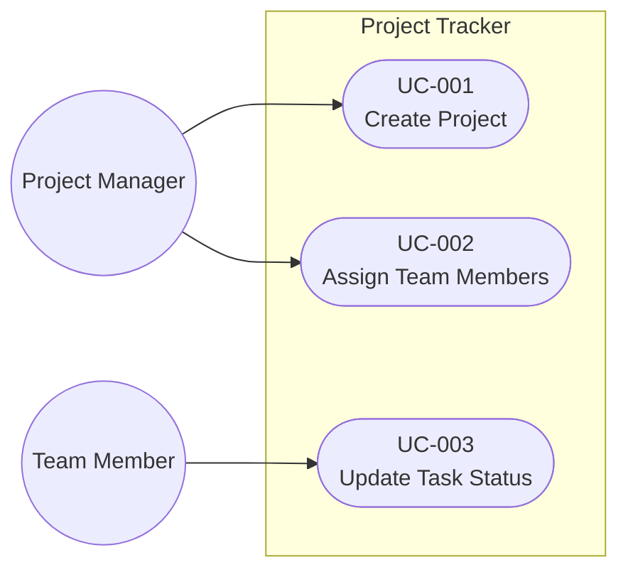

# Project Tracker Requirements

## Functional Requirements

| ID | User Story | Priority | Status |
|---|---|---|---|
| FR-001 | As a Project Manager, I want to create a project so that the team knows its goal. | High | Approved |
| FR-002 | As a Project Manager, I want to assign team members so that responsibilities are clear. | High | Approved |
| FR-003 | As a Team Member, I want to update task status so that progress is visible. | High | Approved |
| FR-004 | As an Auditor, I want to view the complete audit log so that I can verify compliance. | High | Approved |
| FR-005 | As an Auditor, I want to export an audit log date range so that I can submit it for review. | Medium | Approved |

## Non-Functional Requirements

| ID | Requirement | Status |
|---|---|---|
| NFR-001 | Dashboard loads in under 2 seconds for 200 users. | Approved |

## Constraints

| ID | Constraint | Status |
|---|---|---|
| C-001 | The system is deployable on premises. | Approved |

## Use Case Diagram

