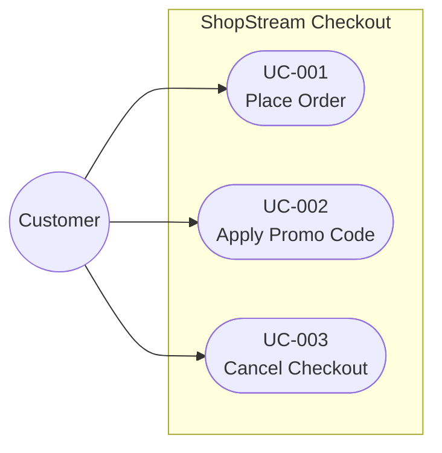

# ShopStream Checkout Requirements

## Functional Requirements

| ID | User Story | Status |
|---|---|---|
| FR-001 | As a Customer, I want to review my cart so that I can confirm my purchase. | Approved |
| FR-002 | As a Customer, I want to select a shipping address so that delivery reaches the correct location. | Approved |
| FR-003 | As a Customer, I want to choose shipping so that I can balance speed and cost. | Approved |
| FR-004 | As a Customer, I want to provide payment details so that I can complete my purchase. | Approved |
| FR-005 | As a Customer, I want confirmation so that I know my purchase succeeded. | Approved |
| FR-006 | As a Customer, I want to know when payment is declined so that I can try another method. | Approved |
| FR-007 | As a Customer, I want to know when an item becomes unavailable so that I can adjust my order. | Approved |
| FR-008 | As a Customer, I want to apply one promo code so that I receive a discount. | Approved |

## Non-Functional Requirements

| ID | Requirement | Status |
|---|---|---|
| NFR-001 | Checkout pages load within 2 seconds. | Approved |

## Constraints

| ID | Constraint | Status |
|---|---|---|
| C-001 | Use the approved payment gateway. | Approved |

## Use Case Diagram

