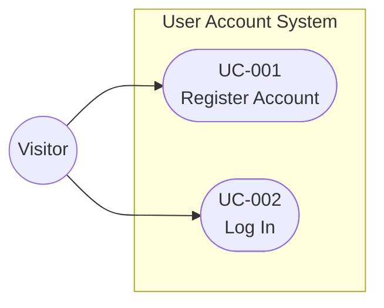

# User Account Requirements

## Functional Requirements

| ID | User Story | Status |
|---|---|---|
| FR-001 | As a visitor, I want to register with email and password so that I can access the platform. | Draft |
| FR-002 | As a visitor, I want my email verified so that the system confirms my identity. | Draft |
| FR-003 | As a visitor, I want to log in so that I can access my account. | Draft |
| FR-004 | As a registered user, I want account lockout after five failed attempts so that my account is protected. | Draft |

## Non-Functional Requirements

| ID | Requirement | Status |
|---|---|---|
| NFR-001 | Login loads within 2 seconds. | Draft |

## Constraints

| ID | Constraint | Status |
|---|---|---|
| C-001 | Passwords have at least eight characters and one digit. | Draft |

## Use Case Diagram

