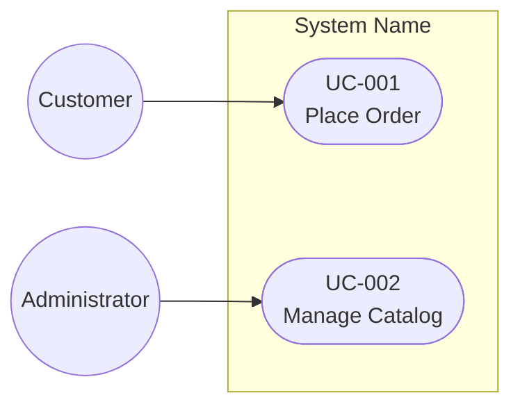
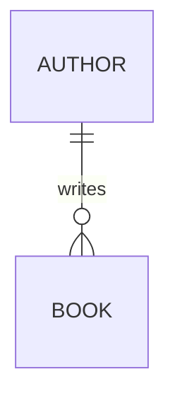

<!--
Copyright 2025-2026 Simon Martinelli and the AI Unified Process contributors.
Part of the AI Unified Process — https://unifiedprocess.ai
Licensed under the Apache License, Version 2.0. See LICENSE and NOTICE.
-->

# Reverse-Engineering Artifact Contract

Use these formats after discovery and aggregation. They mirror the forward AIUP skills.

## Contents

- Requirements Markdown and use-case diagram
- Use-case specification files
- Entity model
- Type and relationship mapping

## Requirements Markdown and Use-Case Diagram

Create or update `docs/requirements.md`. Preserve existing requirements content. The diagram has one stable location:

````markdown
## Use Case Diagram


````

Keep exactly one `## Use Case Diagram` heading and one fenced `mermaid` block below it. Connect every actor and use case. Do not create a separate diagram file.

Use the same headings and tables as
[the requirements skill](../../aiup-requirements/SKILL.md), including
`## Requirements Notes`. Preserve existing rows and IDs when updating.

For recovered functional behaviour, create FR rows in user-story form with ID,
Title, User Story, Priority and Status. Use `To confirm` for unknown priority;
use Implemented only with direct implementation evidence, and do not equate code
presence with verification or stakeholder approval. In Requirements Notes, link
each recovered FR to source files, distinguish observed behaviour from accepted
intent, and record uncertainty or divergence. Apply the corresponding German
vocabulary when appropriate.

NFR and constraint sections retain their table headers even when no rows are
evidenced. State that limitation in Requirements Notes; do not invent thresholds
or unsupported constraints to fill the tables.

Add FR mappings inside the diagram as comments, for example `%% UC-001 -> FR-001`.
Every mapped FR must exist. Include the same evidenced IDs in the UC Overview's
Requirements field. If the link cannot be established, report the gap and leave
the UC Draft rather than inventing a requirement.

## Use-Case Specification Files

Name each file `docs/use_cases/UC-XXX-<diagram-name-in-kebab-case>.md`. Use exactly one use case per file.

Required structure:

````markdown
# Use Case: [Name]

## Overview

**Use Case ID:** UC-XXX
**Use Case Name:** [Name]
**Primary Actor:** [Role]
**Goal:** [Observable outcome]
**Status:** Implemented | Draft
**Requirements:** [FR-001](../requirements.md)
**Stakeholders:** [Affected roles/groups]
**Trigger:** [Starting event/action]

## Preconditions

- [Verifiable fact]

## Main Success Scenario

1. [Actor action]
2. [System response]

## Alternative Flows

### A1: [Name]

**Trigger:** [Condition] (step N)
**Flow:**

1. [Divergent behaviour]
2. Use case continues at step N. *(or: Use case ends.)*

## Postconditions

### Success Postconditions

- [Result]

### Failure Postconditions

- [Failure state]

## Business Rules

### BR-XXX: [Name]

[Rule]
````

Use business language. For example, translate `POST /orders` into “System creates the order”, a validation exception into the rejected condition, and a mail call into “System sends a confirmation email”.

## Entity Model

Create `docs/entity_model.md` with relationships only in Mermaid and a five-column table for every entity:

````markdown
# Entity Model

## Entity Relationship Diagram



### BOOK

A title available in the catalogue.

| Attribute | Description       | Data Type | Length/Precision | Validation Rules                  |
|-----------|-------------------|-----------|------------------|-----------------------------------|
| id        | Unique identifier | Long      | 19               | Primary Key, Sequence             |
| title     | Book title        | String    | 200              | Not Null                          |
| author_id | Author            | Long      | 19               | Not Null, Foreign Key (AUTHOR.id) |
````

Use the canonical [entity vocabulary and cardinality rules](../../aiup-entity-model/references/REFERENCE.md).
Preserve UUID/string/numeric key types, actual key generation, optional foreign
keys, signed decimals and evidenced bounds. `Unknown` and `Unbounded` are distinct;
never invent a default length, range or mandatory relationship.

## Type and Relationship Mapping

| Source signal                          | AIUP representation                                                 |
|----------------------------------------|---------------------------------------------------------------------|
| bigint ID generated by a sequence      | Long, 19, Primary Key, Sequence                                     |
| integer identity ID                    | Integer, 10, Primary Key, Identity                                  |
| application-generated UUID key         | UUID, -, Primary Key, Application Generated                         |
| database-generated UUID key            | UUID, -, Primary Key, Database Default (safe evidenced description) |
| bounded varchar                        | String, actual bound, evidenced nullability                         |
| text with no length bound              | String, Unbounded, evidenced nullability                            |
| string whose bound was not established | String, Unknown, evidenced nullability                              |
| decimal/numeric(p,s)                   | Decimal, p,s; no Min/Max without separate evidence                  |
| timestamp/datetime                     | DateTime, -; preserve timezone semantics in Constraints             |
| nullable foreign key                   | Optional, Foreign Key (TABLE.attribute)                             |
| unique nullable foreign key            | Optional, Foreign Key (TABLE.attribute), Unique                     |

A unique FK limits multiplicity only. For parent A and child B, a non-null unique
FK normally gives `A ||--o| B`, while a nullable unique FK gives `A |o--o| B`.
Use `A ||--|| B` only when both mandatory participation rules are evidenced.
Represent a domain join entity with its separate FKs and composite constraints.
Add source paths and unresolved mappings after the attribute table. Do not claim
migration readiness when a source type or constraint remains unrepresented.

See [the recovery acceptance fixtures](recovery-fixtures.md) for signed decimal,
UUID and nullable unique-FK cases. These are evaluation cases for agents, not a
claim that a deterministic schema conversion tool exists.
