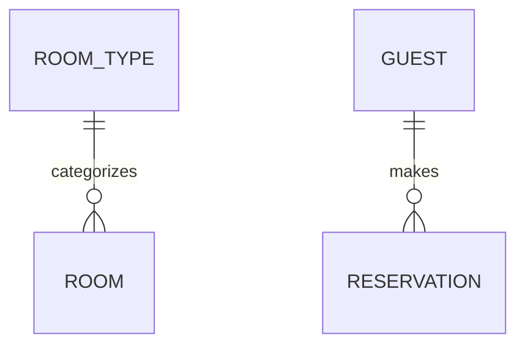

# Entity Model

## Instructions

Create or update the entity model based on the requirements catalog. Resolve the output path first: if a service/module is in scope or cwd is inside a monorepo service, write `<service>/docs/entity_model.md`; otherwise write `docs/entity_model.md`.
The document contains an ER diagram and attribute tables. Treat it as the schema source of truth for downstream migrations; migration skills should reference it with `-- Source: docs/entity_model.md` or the resolved service-relative path.

## DO NOT

- Add attributes/columns to the Mermaid diagram
- Write prose descriptions like "Key attributes: name, email..."
- Create a "Relationships" table

## Path and Language Resolution

- Detect monorepo services from `mise.toml` (`monorepo_root` or namespaced tasks) or multiple sibling `settings.gradle.kts` builds.
- Read `requirements.html` from the same resolved docs directory.
- Detect existing docs language when updating; default to English for new docs.
- If the Compose/Ktor/Exposed stack plugin is installed, its `implementation-status` skill may add an implementation-status matrix to this file after code/migrations exist.

## Document Structure

```markdown
# Entity Model

## Entity Relationship Diagram



### ENTITY_NAME

One sentence describing the entity.

| Attribute | Description | Data Type | Length/Precision | Validation Rules      |
|-----------|-------------|-----------|------------------|-----------------------|
| id        | ...         | Long      | 19               | Primary Key, Sequence |
| ...       | ...         | ...       | ...              | ...                   |

## Required Format for Each Entity

Every entity MUST have:

1. A ### heading with ENTITY_NAME
2. One sentence description
3. An attribute table with exactly 5 columns

### Example Entity

### ROOM_TYPE

Defines categories of rooms with shared characteristics.

| Attribute   | Description              | Data Type | Length/Precision | Validation Rules          |
|-------------|--------------------------|-----------|------------------|---------------------------|
| id          | Unique identifier        | Long      | 19               | Primary Key, Sequence     |
| name        | Name of the room type    | String    | 50               | Not Null, Unique          |
| description | Detailed description     | String    | 500              | Optional                  |
| capacity    | Maximum number of guests | Integer   | 10               | Not Null, Min: 1, Max: 10 |
| price       | Price per night in CHF   | Decimal   | 10,2             | Not Null, Min: 0          |

## Mermaid Diagram Rules

- Show entity names and relationships ONLY
- NO attributes inside entity blocks
- Use relationship syntax: `ENTITY_A ||--o{ ENTITY_B : "relationship"`

## Reference

See [references/REFERENCE.md](references/REFERENCE.md) for the allowed Validation Rules values (never leave the column empty)
and the Data Types with their Length/Precision conventions.

## Multi-Column Constraints

If validation spans multiple columns, add after the table:

**Constraints:** Check-out date must be after check-in date.

## Workflow

1. Resolve docs path: `<service>/docs/` for a scoped monorepo service, otherwise `docs/`.
2. Read the requirements document from the resolved docs path.
3. Use TodoWrite to create a task for each entity.
4. Write the document header and ER diagram (relationships only).
5. For each entity:
    - Write ### heading
    - Write one sentence description
    - Write attribute table with 5 columns
    - Add constraints if needed
    - Mark todo complete
6. Validate the document:
    - Every entity in the ER diagram has a corresponding attribute table section
    - Every attribute table has exactly 5 columns
    - No attributes appear inside the Mermaid diagram entity blocks
    - All foreign keys reference existing entities
    - All validation rules use values from [references/REFERENCE.md](references/REFERENCE.md)
